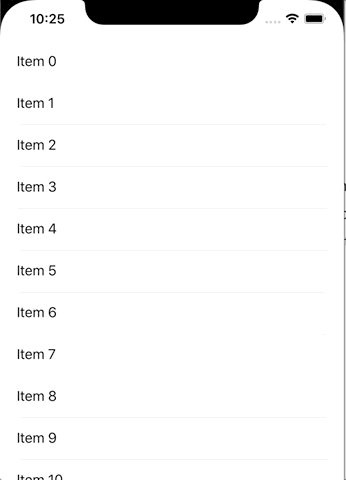

# RefreshableList
A refreshable List. Performing an action when scrolling to the last row.


## Installation
In XCode, go to `File -> Swift Packages -> Add Package Dependency`, and add the following url.
https://github.com/phuhuynh2411/RefreshableList.git

## Usage
Supports two main functions
- onRefreshPerform: performs an action when pulling the list down and releases.
- onLastPerform: performs an action when scrolling to the last row.

```swift
struct ContentView: View {
    @State var showRefresh: Bool = false
    var body: some View {
        RefreshableList(showRefreshView: $showRefresh){
            ForEach(0..<20, id: \.self) { index in
                VStack(alignment: .leading){
                    Text("Item \(index)")
                    Divider()
                }
            }
        }
        .onRefreshPerform {
            print("add your action here")
            self.showRefresh = false
        }
        .onLastPerform {
            // add your code here
            print("on last row")
        }
    }
}
```
